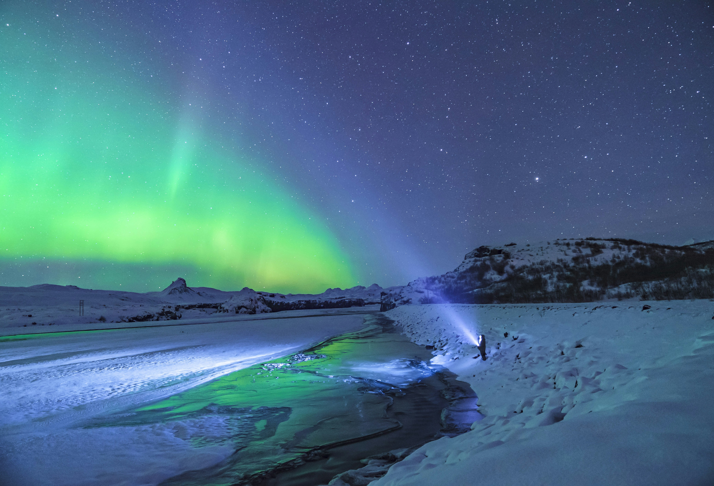
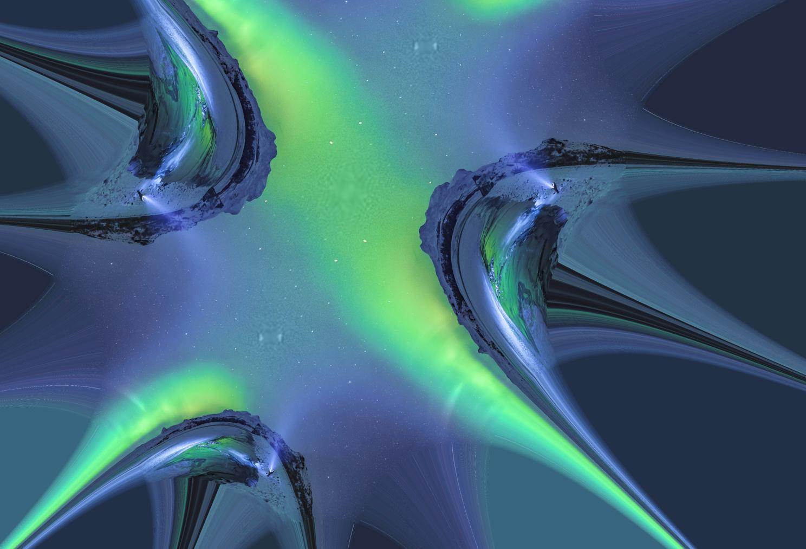

# fractal_media

A Python package that applies fractal mathematics to warp images and videos using complex plane transformations.

---

## How it works

The core idea is to treat each pixel's coordinates as a point on the complex plane, iteratively apply a transformation (Z → Z² with a shift), then use the resulting coordinates to remap pixels in the original media. This produces a warped, fractal-distorted version of the input.

**Input**


**Output**


---

## Installation

from source:

```bash
git clone https://github.com/Mitchell-Gerrard/fractal_media
cd fractal_media
pip install .
```

## Usage

### Images

```python
from fractal_media import photo_fractal

pf = photo_fractal("input.jpg")
pf.generate_fractal(num_iterations=5, shift=0.1, scale=2)
pf.save_fractal("output.jpg", dpi=300)
```

### Video

```python
from fractal_media import video_fractal

vf = video_fractal()
vf.generate_fractal(
    input_video="input.mp4",
    output_video="output.mp4",
    num_iterations=5,
    shift=0.1,
    scale=2,
    flip=False
)
```

### Parameters

| Parameter | Description |
|---|---|
| `num_iterations` | Number of times the complex transformation is applied — higher values produce more extreme warping |
| `shift` | Offset applied to the complex plane before each iteration |
| `scale` | Controls the extent of the complex plane mapped to the image |
| `flip` | Video only — OpenCV flip code (0 = vertical, 1 = horizontal, -1 = both) |

---

## Requirements

```
numpy
matplotlib
pillow
opencv-python
tqdm
```

---

## Roadmap

- [x] Image fractal warping
- [x] Video fractal warping
- [ ] Audio fractal transformation
- [ ] Text fractal transformation

---

## Credits

Demo image by Jonatan Pie — [Unsplash](https://unsplash.com/@r3dmax) under the Unsplash free use licence.
